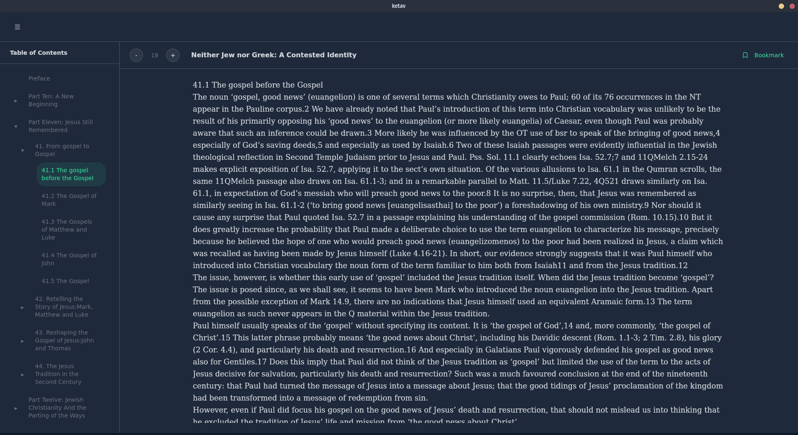
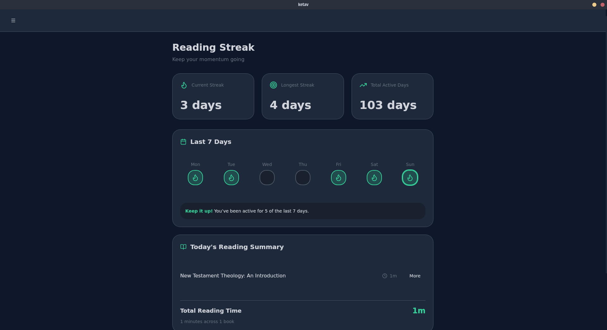
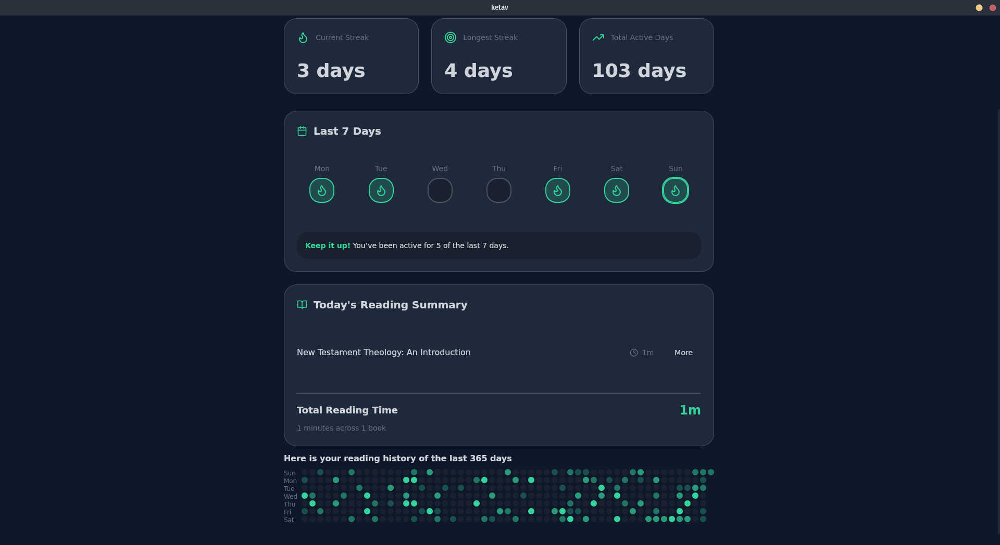
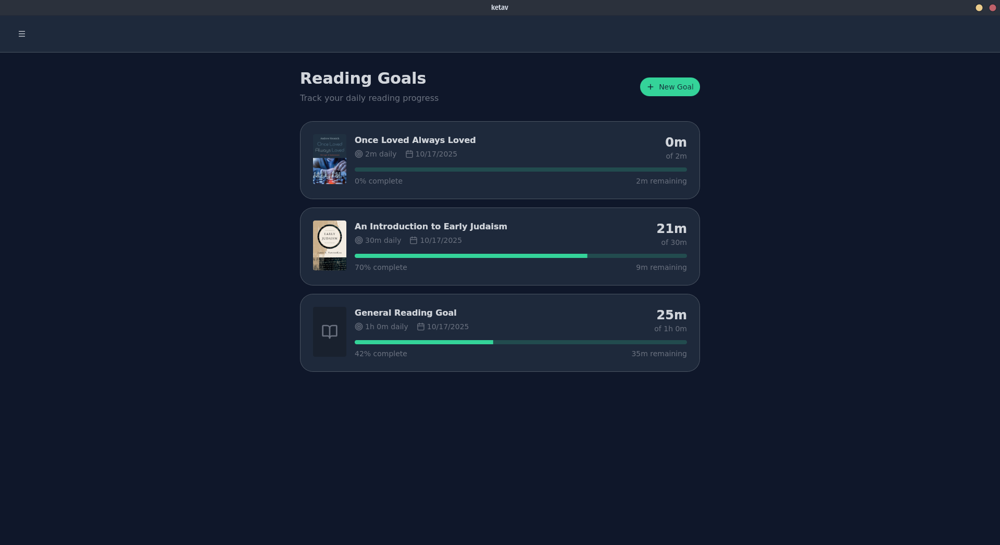
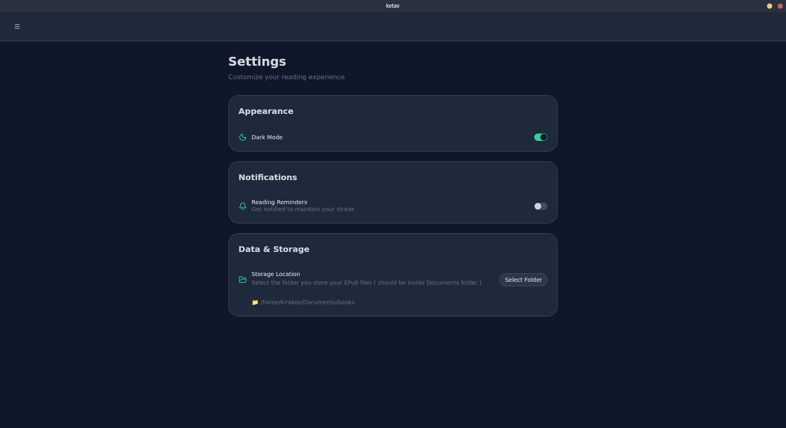

# Ketav

A local-first cross platform EPUB made to help people read consistently. Features include:

- track daily reading minutes (accurately, only while you’re actively reading),
- show streaks (current + longest) and weekly summaries at a glance,
- break down exactly which books and how much time have been read in the last 7 days,
- Goal-oriented reading to help keep reading consistency
- keep all data on your device (no cloud required)

## Screenshots








## Download (beta)

The beta version is released for Windows and couple of linux flavors. You can find them all [here](https://github.com/henacodes/ketav/releases/tag/v0.1.0)

## Building from Source

To build the project from source, you would first need to install Rust and Cargo an other necessary tools depending on the target OS you are building for. Head over to [Tauri-Docs](https://tauri.app/start/prerequisites/) to see how.

After you finish configuring your machine

```bash
$ git clone git@github.com:henacodes/ketav.git
$ cd ketav
$ npm i
// To run the project on dev server
$ npm run tauri dev
// To build it
$ npm run tauri build
```

## Recommended IDE Setup

- [VS Code](https://code.visualstudio.com/) + [Tauri](https://marketplace.visualstudio.com/items?itemName=tauri-apps.tauri-vscode) + [rust-analyzer](https://marketplace.visualstudio.com/items?itemName=rust-lang.rust-analyzer)
